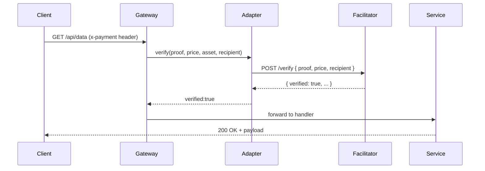

# x402-gateway

**HTTP-native economic authorization middleware** for Web2 backends.

`x402-gateway` allows any HTTP API endpoint to require **cryptographic payments per request** using the reserved status code `402 Payment Required`, without forcing Web2 teams to learn blockchain, wallets, smart contracts, or facilitator logic.

`x402-gateway` does **not execute payments**.
It delegates verification to **external facilitators** (e.g., Coinbase, Thirdweb), and enforces access at the HTTP boundary.

---

## Why this exists

Current payment models for API access are stuck in 2005:

* API keys
* OAuth2 tokens
* Billing dashboards
* Rate limits
* Subscriptions
* Usage aggregation
* Post-paid invoices

This breaks down for **autonomous agents**, **usage-based compute**, and **machine-to-machine payments**.

x402 introduces a missing primitive:

> **Economic Authorization**
> — pay before you get the resource, enforced at HTTP level

This library is the **gateway component** of that model.

---

## What `x402-gateway` does

When attached to an HTTP route:

1. If the requester did **not** provide a payment proof →
   Respond with `402` and pricing metadata in headers.

2. If the requester **did** provide a payment proof →
   Gateway forwards it to a facilitator adapter.

3. If the facilitator verifies payment →
   Gateway allows the request to proceed.

4. If verification fails or facilitator is unavailable →
   Gateway rejects the request (`402` or `502` accordingly).

---

## Goals 

* Web2-friendly ergonomics
* Facilitator-agnostic via **adapters**
* **Fail-closed** default behavior
* **Static pricing**
* **Per-route configuration**
* **Zero crypto knowledge** required for integration
* Minimal conceptual footprint

---

## Non-Goals 

* Settlement logic
* Wallet UX
* Token routing
* Dynamic pricing
* Multi-facilitator negotiation
* Asset discovery
* Replay protection (belongs to facilitator)

---

# High-Level Architecture

**Control Plane View**

```mermaid
flowchart LR
    Client -->|HTTP Request| Gateway
    Gateway -->|verify()| Adapter
    Adapter -->|Verification API| Facilitator
    Facilitator -->|Response| Adapter
    Adapter -->|Result| Gateway
    Gateway -->|Allow or 402/502| Application
```

**Responsibility Separation**

| Component   | Responsibility                           |
| ----------- | ---------------------------------------- |
| Client      | Produces payment proof                   |
| Gateway     | Enforces `402` at HTTP boundary          |
| Adapter     | Facilitator-specific logic               |
| Facilitator | Payment verification + settlement        |
| Application | Business logic (runs only after payment) |

---

# Request Flow (Successful)



### Failure Cases

| Case             | HTTP | Class        |
| ---------------- | ---- | ------------ |
| No payment proof | 402  | input        |
| Payment invalid  | 402  | verification |
| Facilitator down | 502  | infra        |
| Gateway bug      | 500  | internal     |

---

# Adapter Layer (Key Design)

`x402-gateway` is **facilitator-agnostic** via an adapter system.

Official adapters ship under scoped packages:

```
@x402/adapter-coinbase
@x402/adapter-thirdweb
...
```

Adapters are responsible for:

* Calling facilitator APIs
* Normalizing verification results
* Mapping facilitator errors
* Matching amount and asset
* Ensuring recipient correctness

Gateway remains ignorant of facilitator semantics.

---

# Example: Express Integration

```ts
import express from "express";
import { x402 } from "@x402/gateway-express";
import CoinbaseAdapter from "@x402/adapter-coinbase";

const app = express();

app.get(
  "/api/data",
  x402({
    price: "0.01",             // static price
    recipient: "0xMerchant",   // EVM address
    adapter: CoinbaseAdapter({ apiKey: process.env.COINBASE_KEY })
  }),
  (req, res) => {
    res.json({
      message: "Hello, paid world!",
      payment: req.x402
    });
  }
);

app.listen(3000);
```

Now the endpoint is economically gated.

---

# 402 Response Format

If no payment proof is provided:

```
HTTP/1.1 402 Payment Required
x402-price: 0.01
x402-asset: ETH
x402-recipient: 0xMerchant
x402-facilitator: coinbase
```

Body:

```json
{
  "error": {
    "origin": "gateway",
    "class": "input",
    "code": "GATEWAY_INVALID_MISSING_PROOF",
    "message": "Missing payment proof",
    "details": {
      "reason": "missing_header"
    }
  },
  "x402": {
    "price": "0.01",
    "asset": "ETH",
    "recipient": "0xMerchant",
    "facilitator": "coinbase"
  }
}
```

This gives clients enough info to initiate payment UX.

---

# Verification Result Shape

If payment is valid, handler sees:

```ts
req.x402 = {
  verified: true,
  payer: "0xPayer",
  recipient: "0xMerchant",
  amount: "0.01",
  asset: "ETH"
};
```

---

# Error Model (V1)

Errors are structurally classified:

```ts
class X402Error {
  origin: "gateway" | "adapter" | "facilitator";
  class: "input" | "verification" | "infra" | "internal";
  code: string;
  message: string;
}
```

HTTP mapping:

| Class        | HTTP | Meaning                      |
| ------------ | ---- | ---------------------------- |
| input        | 402  | malformed/missing proof      |
| verification | 402  | facilitator rejected payment |
| infra        | 502  | facilitator unavailable      |
| internal     | 500  | gateway bug                  |

Internal errors are masked for security.

---

# Configuration Surface (V1)

```ts
type X402GatewayConfig = {
  adapter: FacilitatorAdapter;
  price: string;             // required
  recipient: string;         // required
  asset?: string;            // optional (defaults to ETH)
  header?: string;           // optional (defaults to x-payment)
  timeoutMs?: number;        // optional (defaults to 2000)
}
```

---

# Adapter Interface

Adapters must implement:

```ts
interface FacilitatorAdapter {
  name: string;
  interfaceVersion: "1.0.0";
  verify(input: {
    proof: unknown;
    price: string;
    asset: string;
    recipient: string;
  }): Promise<VerificationResult>;
}
```

Where:

```ts
type VerificationResult =
  | { verified: true; payer; recipient; amount; asset; }
  | { verified: false; reason; raw? }
```

---

# Facilitator Responsibilities

Facilitators are expected to:

* Validate signatures or vouchers
* Prevent replay
* Validate on-chain settlement or intent
* Confirm recipient correctness
* Return normalized payer + amount
* Handle asset conversions if needed

Gateway blindly trusts facilitator result — by design.

---

# Architectural Diagram (Component View)

```mermaid
graph TD
    subgraph Client Space
      C1[Client/Agent]
    end

    subgraph Gateway Space
      G1[x402-gateway]
      A1[Adapter]
    end

    subgraph Facilitator Space
      F1[Facilitator API]
      Chain[(Settlement Layer)]
    end

    C1 -->|HTTP + proof| G1
    G1 -->|verify()| A1
    A1 -->|HTTP API| F1
    F1 -->|settle/verify| Chain
    F1 -->|result| A1
    A1 -->|result| G1
```

---

# Why Web2 Companies Care

This gives Web2 engineers:

* Usage-based billing without accounts
* Payment gating without crypto knowledge
* No Web3 SDKs
* No smart contracts
* No wallets
* No blockchain infra

It gives Web3 infra teams:

* A standardized enforcement boundary
* A route to real-world adoption

---

# Roadmap

| Version | Feature                                        |
| ------- | ---------------------------------------------- |
| v1      | EVM, static pricing, Coinbase + Thirdweb       |
| v2      | Dynamic pricing, replay windows, multi-asset   |
| v3      | Facilitator negotiation, agent pricing markets |
| v4      | Protocol standardization                       |

---

# Status

**Early reference implementation.**
Breaking changes are likely until v1.0.

---