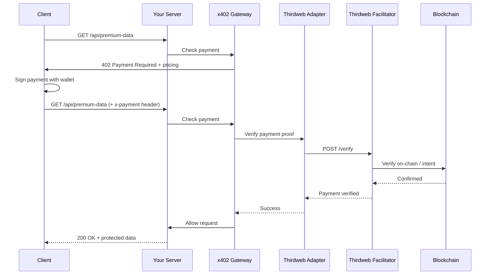

# x402 Gateway: Complete Testing Guide

This guide covers both **local testing with mock facilitator** and **production testing with real Thirdweb facilitator**.

---

## Table of Contents
1. [Quick Start: Local Testing (Mock)](#quick-start-local-testing-mock)
2. [Production: Real Thirdweb Facilitator](#production-real-thirdweb-facilitator)
3. [Architecture](#architecture)
4. [Troubleshooting](#troubleshooting)

---

# Quick Start: Local Testing (Mock)

Test the complete payment flow locally without blockchain or real payments.

## Prerequisites
- Node.js >= 18.0.0

## 3-Terminal Setup

### Terminal 1: Start Mock Facilitator
```bash
cd examples/test-server
npm install
npm run mock
```

### Terminal 2: Start Server (Mock Mode)
```bash
# Make sure USE_MOCK=true in .env
npm start
```

### Terminal 3: Run Test Client
```bash
npm run client
```

## Expected Output

You'll see the complete x402 flow:
1. ✅ Request without payment → `402 Payment Required`
2. ✅ Create payment proof
3. ✅ Retry with payment → `200 OK` + protected data

---

# Production: Real Thirdweb Facilitator

Use x402 with real payment verification through Thirdweb's facilitator API.

## Part 1: Install and Wrap Your API

### Step 1: Install Packages

**Option A: From NPM (once published)**
```bash
npm install @x402/gateway-express @x402/adapter-thirdweb
```

**Option B: From GitHub (current)**
```bash
npm install \
  "github:Animesh-Parashar/x402-gateway#main:packages/gateway-express" \
  "github:Animesh-Parashar/x402-gateway#main:packages/adapter-thirdweb"
```

**Option C: Local Development**
```json
{
  "dependencies": {
    "@x402/gateway-express": "file:../../packages/gateway-express",
    "@x402/adapter-thirdweb": "file:../../packages/adapter-thirdweb"
  }
}
```

### Step 2: Get Thirdweb API Key

1. Go to [Thirdweb Dashboard](https://thirdweb.com/dashboard)
2. Create an account or sign in
3. Create a new project
4. Copy your **API Key**

### Step 3: Wrap Your API

Create your server with x402 payment protection:

```javascript
// server.js
import express from "express";
import { x402 } from "@x402/gateway-express";
import ThirdwebAdapter from "@x402/adapter-thirdweb";
import dotenv from "dotenv";

dotenv.config();

const app = express();
app.use(express.json());

// Configure Thirdweb adapter
const thirdwebAdapter = ThirdwebAdapter({
  apiKey: process.env.THIRDWEB_API_KEY,
  baseUrl: "https://x402.thirdweb.com",  // or your custom facilitator
  timeoutMs: 5000
});

// Free endpoint (no payment)
app.get("/", (req, res) => {
  res.json({ message: "Welcome to my API!" });
});

// Protected endpoint - requires 0.01 ETH payment
app.get(
  "/api/premium-data",
  x402({
    price: "0.01",
    asset: "ETH",
    recipient: process.env.RECIPIENT_ADDRESS,  // Your wallet address
    adapter: thirdwebAdapter
  }),
  (req, res) => {
    // This code only runs if payment is verified!
    res.json({
      message: "Payment successful!",
      payment: req.x402,  // Payment details
      data: {
        // Your protected data here
        value: "This is premium content",
        timestamp: new Date().toISOString()
      }
    });
  }
);

app.listen(3000, () => {
  console.log("🚀 x402 Protected API running on http://localhost:3000");
});
```

### Step 4: Configure Environment Variables

Create `.env`:
```bash
# REQUIRED: Your Thirdweb API key
THIRDWEB_API_KEY=your_api_key_here

# REQUIRED: Your wallet address to receive payments
RECIPIENT_ADDRESS=0xYourWalletAddress
```

### Step 5: Start Your Server

```bash
node server.js
```

Your API is now protected with x402! 🎉

---

## Part 2: Test with Real Payments

To test your protected API with real Thirdweb facilitator, you need to generate valid payment proofs.

### Understanding Payment Proofs

A payment proof is a cryptographically signed authorization for payment. With Thirdweb, you have several options:

#### Option 1: Using Thirdweb SDK (Recommended)

Create a client application using Thirdweb's SDK:

```javascript
// real-client.js
import { createThirdwebClient } from "thirdweb";
import { base } from "thirdweb/chains";
import { privateKeyToAccount } from "thirdweb/wallets";

const client = createThirdwebClient({
  clientId: process.env.THIRDWEB_CLIENT_ID
});

const account = privateKeyToAccount({
  client,
  privateKey: process.env.WALLET_PRIVATE_KEY
});

async function makePaymentRequest(url, price, recipient) {
  console.log(`\n📡 Making request to ${url}`);
  
  // Step 1: First request (no payment) to get requirements
  let response = await fetch(url);
  
  if (response.status === 402) {
    console.log("✅ Received 402 Payment Required");
    const paymentInfo = await response.json();
    
    console.log("Payment required:", {
      price: paymentInfo.x402.price,
      asset: paymentInfo.x402.asset,
      recipient: paymentInfo.x402.recipient
    });
    
    // Step 2: Generate payment proof using Thirdweb
    // This would use Thirdweb's payment authorization flow
    // The exact implementation depends on Thirdweb's x402 support
    
    console.log("\n🔐 Generating payment proof with Thirdweb...");
    
    // Step 3: Sign payment authorization
    const paymentProof = {
      from: account.address,
      to: recipient,
      amount: price,
      asset: "ETH",
      chainId: base.id,
      timestamp: Date.now(),
      // This would include proper signature from wallet
      signature: await account.signMessage({
        message: JSON.stringify({
          to: recipient,
          amount: price,
          timestamp: Date.now()
        })
      })
    };
    
    // Step 4: Retry with payment proof
    console.log("\n💸 Retrying with payment proof...");
    response = await fetch(url, {
      headers: {
        "x-payment": JSON.stringify(paymentProof)
      }
    });
    
    if (response.ok) {
      console.log("✅ Payment verified! Access granted.");
      const data = await response.json();
      console.log("\n📦 Response:");
      console.log(JSON.stringify(data, null, 2));
      return data;
    } else {
      console.log(`❌ Payment failed: ${response.status}`);
      const error = await response.json();
      console.log(error);
      return null;
    }
  } else if (response.ok) {
    console.log("✅ Free access (no payment required)");
    return await response.json();
  }
}

// Test your protected endpoint
makePaymentRequest(
  "http://localhost:3000/api/premium-data",
  "0.01",
  process.env.RECIPIENT_ADDRESS
).catch(console.error);
```

#### Option 2: Using x402 Client Library

Check [x402 documentation](https://docs.x402.org) for official client libraries:

```bash
npm install @x402/client  # hypothetical package
```

```javascript
import { X402Client } from "@x402/client";

const client = new X402Client({
  wallet: yourWallet,
  facilitator: "https://x402.thirdweb.com"
});

// Automatically handles 402 responses and payments
const response = await client.fetch("http://localhost:3000/api/premium-data");
```

#### Option 3: Manual Testing with curl

For quick testing without client code:

1. **Get payment requirements:**
```bash
curl -i http://localhost:3000/api/premium-data
```

Response:
```
HTTP/1.1 402 Payment Required
x402-price: 0.01
x402-asset: ETH
x402-recipient: 0xYourAddress
x402-facilitator: thirdweb
```

2. **Create payment proof** (using your wallet/Thirdweb)

3. **Make request with proof:**
```bash
curl -H "x-payment: {\"from\":\"0x...\",\"signature\":\"0x...\",...}" \
     http://localhost:3000/api/premium-data
```

---

## Part 3: Complete Real Facilitator Example

Here's a complete working example for production:

### Project Structure
```
my-x402-api/
├── server.js          # Your protected API
├── real-client.js     # Test client with Thirdweb
├── .env              # Configuration
└── package.json
```

### package.json
```json
{
  "name": "my-x402-api",
  "type": "module",
  "scripts": {
    "start": "node server.js",
    "test-client": "node real-client.js"
  },
  "dependencies": {
    "@x402/gateway-express": "^1.0.0",
    "@x402/adapter-thirdweb": "^1.0.0",
    "express": "^4.18.2",
    "dotenv": "^16.3.1",
    "thirdweb": "^5.0.0"  // For client
  }
}
```

### .env
```bash
# Server Configuration
THIRDWEB_API_KEY=your_thirdweb_api_key
RECIPIENT_ADDRESS=0xYourWalletAddress

# Client Configuration (for testing)
THIRDWEB_CLIENT_ID=your_thirdweb_client_id
WALLET_PRIVATE_KEY=your_test_wallet_private_key  # NEVER commit this!
```

### Running the Complete Flow

**Terminal 1: Start Server**
```bash
npm start
```

**Terminal 2: Test with Real Payments**
```bash
npm run test-client
```

---

## Architecture: Local vs Production

### Local Testing (Mock)
```
Test Client
    ↓
Express Server (@x402/gateway-express)
    ↓
Mock Adapter (@x402/adapter-mock)
    ↓
Mock Facilitator (localhost:4000)
    ↓
✅ Always verifies for testing
```

### Production (Thirdweb)
```
Your Client (with Thirdweb SDK)
    ↓
Your API (@x402/gateway-express)
    ↓
Thirdweb Adapter (@x402/adapter-thirdweb)
    ↓
Thirdweb Facilitator API (x402.thirdweb.com)
    ↓
    Settlement on Base/Solana
    ↓
✅ Real payment verification
```

---

## Payment Flow Diagram



---

## Troubleshooting

### Local Testing Issues

**"Cannot connect to mock facilitator"**
- Make sure `npm run mock` is running on port 4000
- Check `USE_MOCK=true` in `.env`

**"Payment verification failed"**
- Ensure payment amount matches the price
- Check mock facilitator logs for details

### Production Issues

**"Thirdweb authentication failed" (401/403)**
- Verify your `THIRDWEB_API_KEY` is correct
- Check API key permissions in Thirdweb dashboard

**"Facilitator unavailable" (502)**
- Check internet connection
- Verify `https://x402.thirdweb.com` is accessible
- Check Thirdweb service status

**"Payment verification failed" (402)**
- Ensure payment proof signature is valid
- Check payment amount matches requirement
- Verify recipient address matches
- Ensure blockchain/network is correct

**"Timeout" errors**
- Increase `timeoutMs` in adapter config
- Check network latency to facilitator

---

## Security Best Practices

### For Server (API Provider)

1. **Never expose private keys** in your server code
2. **Use environment variables** for sensitive config
3. **Validate recipient address** matches your wallet
4. **Log all payment attempts** for audit trail
5. **Set reasonable timeouts** (2-5 seconds)
6. **Use HTTPS in production** for all endpoints

### For Client (API Consumer)

1. **Never commit private keys** to version control
2. **Use hardware wallets** for production payments
3. **Verify payment requirements** before signing
4. **Check recipient address** matches expected API owner
5. **Implement retry logic** with exponential backoff
6. **Store payment receipts** for accounting

---

## Next Steps

1. **Test locally** with mock facilitator
2. **Get Thirdweb API key** for production
3. **Wrap your API** with x402 middleware
4. **Deploy to staging** and test with small amounts
5. **Monitor payments** and adjust pricing
6. **Deploy to production** 🚀

---

## Resources

- [x402 Protocol Docs](https://docs.x402.org)
- [Thirdweb Documentation](https://portal.thirdweb.com)
- [GitHub Repository](https://github.com/Animesh-Parashar/x402-gateway)
- [Example Projects](../examples/)

---

## Getting Help

- Open an issue on [GitHub](https://github.com/Animesh-Parashar/x402-gateway/issues)
- Join [x402 Discord](https://discord.gg/cdp)
- Check [Thirdweb Discord](https://discord.gg/thirdweb)
